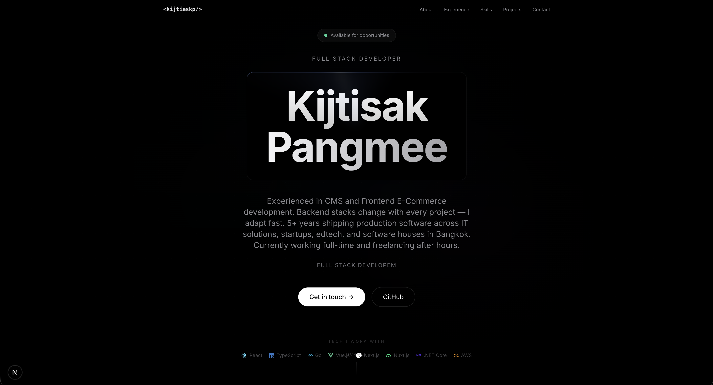

# my-portfolio

Personal portfolio site for **Kijtisak Pangmee** — Full Stack Developer based in Bangkok.

Live: [kijtiaskp.github.io/my-portfolio](https://kijtiaskp.github.io/my-portfolio/)



## Tech Stack

- **Framework** — Next.js 15 (static export)
- **UI** — React 19, Tailwind CSS 3
- **Language** — TypeScript 5
- **Deployment** — GitHub Pages via GitHub Actions
- **Package Manager** — pnpm

## Project Structure

```
app/              → Pages and global styles
components/       → UI components (nav, footer, sections)
data/             → Portfolio data (resume.ts)
hooks/            → Custom React hooks
lib/              → Utilities (tech icon mapping)
types/            → TypeScript interfaces
.github/workflows → CI/CD pipeline
```

## Getting Started

```bash
pnpm install
pnpm dev
```

Open [http://localhost:3000/my-portfolio](http://localhost:3000/my-portfolio)

## Build & Deploy

```bash
pnpm build   # outputs to /out
```

Deployment is automated — push to `main` triggers GitHub Actions which builds and deploys to GitHub Pages.